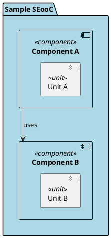
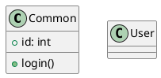

<!-- ----------------------------------------------------------------------------
  Copyright (c) 2026 Contributors to the Eclipse Foundation

  See the NOTICE file(s) distributed with this work for additional
  information regarding copyright ownership.

  This program and the accompanying materials are made available under the
  terms of the Apache License Version 2.0 which is available at
  https://www.apache.org/licenses/LICENSE-2.0

  SPDX-License-Identifier: Apache-2.0
----------------------------------------------------------------------------- -->
# PlantUML Parser

### Processing Phases

The sequence diagram shows the phases of the plantuml processing:


#### 1. Preprocessing Phase

`!include` directives are expanded into a single self-contained `.puml` content per file before any parsing occurs. The supported directives are:

- `!include`
- `!include_once`
- `!include_many`
- `!includesub`

The preprocessor:

- Resolves file paths (absolute and relative)
- Recursively expands nested includes
- Detects circular dependencies and reports an error
- Caches already-resolved files to avoid redundant I/O

#### 2. Parsing Phase

Each preprocessed file is parsed into an AST based on its diagram type. The diagram type is either:

- Specified explicitly via `--diagram-type` CLI argument
- Auto-detected by trying parsers in order (Sequence → Class → Component) until one succeeds
- If all parsers fail, the error with the longest match is reported

#### 3. Semantic Resolution Phase

The AST is resolved into a logical model by the `ComponentResolver`:

- Builds fully qualified names (FQN) for all elements using scope tracking
- Resolves relative and absolute references between components
- Detects duplicate component definitions and unresolved references

#### 4. Serialization Phase

The resolved logical model is serialized to FlatBuffers binary format by `ComponentSerializer` for further downstream processing.

**Example input**



**Raw parse tree output**

```text
=== Parse Tree ===
Rule::startuml -> "@startuml"
    Rule::statement -> "package \"Sample SEooC\" ..."
        Rule::element
            Rule::nested_element -> "package \"Sample SEooC\""
                Rule::default_element
                    Rule::element_kind   -> "package"
                    Rule::default_element_name -> "\"Sample SEooC\""
            Rule::alias          -> "as SampleSEooC"
            Rule::element_style -> "#LightBlue"
            Rule::statement_block -> "{ ... }"
    Rule::relation -> "ComponentA --> ComponentB : uses"
        Rule::relation_object -> "ComponentA"
        Rule::arrow           -> "-->"
        Rule::relation_object -> "ComponentB"
        Rule::description     -> ": uses"
Rule::enduml
=== End Parse Tree ===
```

**Semantic Resolution output**

```
Component(
    name: "<name>"
    id: "<alias>"
    parent: "<id of parent element>"
    stereotype: "<stereotype>"
    type: "<SEooC/Component/Unit>"
)

Relation(
    source: "<id>"
    target: "<id>"
    type: "<e.g. uses>"
)

Interface(
    name: "<name>"
    id: "<alias>"
)
```

---

## Developer Guide

### Module Structure

| Crate | Responsibility |
|---|---|
| `puml_utils` | Shared utilities: `LogLevel` enum, file writing helpers |
| `puml_parser` | Preprocessor (include expansion) + Class / Component / Sequence diagram parsers |
| `puml_resolver` | Resolves raw AST into logical model (`ComponentResolver`, `DiagramResolver` trait) |
| `puml_serializer` | FlatBuffers serialization of the resolved model (`ComponentSerializer`) |
| `puml_lobster` | Converts the resolved model to LOBSTER traceability JSON |
| `puml_cli` | CLI argument parsing and orchestration of all phases |

### Architecture Diagrams

**Class structure:**


**Deployment:**


### DiagramParser Trait

All diagram parsers implement a common trait:

```rust
pub trait DiagramParser {
    type Output;
    type Error;

    fn parse_file(
        &mut self,
        path: &Rc<PathBuf>,
        content: &str,
        log_level: LogLevel,
    ) -> Result<Self::Output, Self::Error>;
}
```

`LogLevel` for the complete parser is defined in `puml_utils`:

```rust
#[derive(Debug, Clone, Copy, PartialEq, Eq)]
pub enum LogLevel {
    Error,
    Warn,
    Info,
    Debug,
    Trace,
}
```

### Error Hierarchy

A layered error hierarchy allows integration tests to handle errors uniformly without duplicating error-matching logic at each layer:

```
BaseParseError<Rule>      // IoError, SyntaxError
         ↓
IncludeParseError         // BaseParseError + InvalidTextLine
         ↓
PreprocessError           // IncludeParseError + FileNotFound, CycleInclude, ...
```

Each level wraps the level below as a `#[source]`, enabling structured nested error reporting:

```yaml
error:
  type: ParseFailed
  fields:
    file: main.puml
  source:                  # ← Nested error
    type: IoError
    fields:
      path: missing.puml
```

`BaseParseError` definition:

```rust
#[derive(Debug, thiserror::Error)]
pub enum BaseParseError<Rule> {
    #[error("Failed to read include file {path}: {error}")]
    IoError {
        path: PathBuf,
        #[source]
        error: Box<std::io::Error>,
    },

    #[error("Pest error: {message}")]
    SyntaxError {
        file: PathBuf,
        line: usize,
        column: usize,
        message: String,
        source_line: String,
        #[source]
        cause: Option<Box<pest::error::Error<Rule>>>,
    },
}
```

### Include Preprocessor

The preprocessor pipeline consists of three stages executed per file:

#### Parse AST

The `.puml` file is parsed by the pest include grammar into a `Vec<PreprocessStmt>`:

```rust
[
    PreprocessStmt::Text("@startuml\n"),
    PreprocessStmt::Include(
        IncludeStmt::Include {
            kind: IncludeKind::Include,
            path: "common.puml"
        }
    ),
    PreprocessStmt::Text("class User {}\n"),
    PreprocessStmt::Text("@enduml\n")
]
```

#### Expand Statements

Each `Include` statement is resolved and replaced with the included file's content:

```rust
[
    PreprocessStmt::Text("@startuml\n"),
    PreprocessStmt::Text("class Common {\n    +id: int\n    +login()\n}\n"),
    PreprocessStmt::Text("class User {}\n"),
    PreprocessStmt::Text("@enduml\n")
]
```

Included files may themselves contain includes, making this step recursive. See the sequence diagram for the full recursive flow:


#### Render

The expanded `Vec<PreprocessStmt>` is rendered back to a plain `.puml` string:



### Integration Test Framework

The integration test framework provides golden-based testing for all diagram parsers, supporting multi-file test cases, string/AST output comparison, and structured error expectations.

#### Test Case Layout

Each test case is a directory under `integration_test/<test_module>/<case_name>/`:

```
integration_test/<test_module>/<case_name>/
    ├── a.puml
    ├── b.puml
    └── output.yaml   # or output.json
```

#### Golden File Formats

**`output.yaml` — text output comparison**

Use YAML when the expected output is rendered text. Whitespace is normalized automatically.

```yaml
a.puml: |
    @startuml
    Alice -> Bob
    @enduml
```

**`output.json` — AST comparison**

Use JSON when comparing AST structures directly. Each top-level key maps to a `.puml` file; the value must match the AST type exactly (requires `Deserialize` and `PartialEq`).

```json
{
    "a.puml": {
        "name": [],
        "elements": []
    },
    "b.puml": {}
}
```

#### Error Expectations

Errors are described in `output.yaml` using a structured format:

```yaml
a.puml:
  error:
    type: SyntaxError
    fields:
      file: a.puml
      line: "10"
      column: "5"
      message: "unexpected token"
      source_line: "A -> B"
```

The framework compares actual errors against expectations via the `ErrorView` trait:

```rust
pub struct ProjectedError {
    pub kind: String,
    pub fields: HashMap<String, String>,
    pub source: Option<Box<ProjectedError>>,  // nested cause
}

pub trait ErrorView {
    fn project(&self, base_dir: &Path) -> ProjectedError;
}
```

Each error type implements `ErrorView` to produce a path-relative, uniformly comparable structure. Nested errors (via `#[source]`) are represented recursively through `source`.

#### Core Traits

**`DiagramProcessor`** — runs the parser under test and returns one output per input file:

```rust
pub trait DiagramProcessor {
    type Output;
    type Error;

    fn run(
        &self,
        files: &HashSet<Rc<PathBuf>>,
    ) -> Result<HashMap<Rc<PathBuf>, Self::Output>, Self::Error>;
}
```

**`ExpectationChecker`** — compares actual output or errors against the golden file:

```rust
pub trait ExpectationChecker<Error: ErrorView, Output: AsRef<str> + Debug + PartialEq> {
    fn check_ok(&self, actual: &Output, expected: &Expected<Output>);
    fn check_err(&self, err: &Error, expected: &YamlValue, base_dir: &Path);
}
```

A default implementation covering string, AST, and error comparison is provided. Implement a custom `ExpectationChecker` only when specialized comparison logic is needed.
